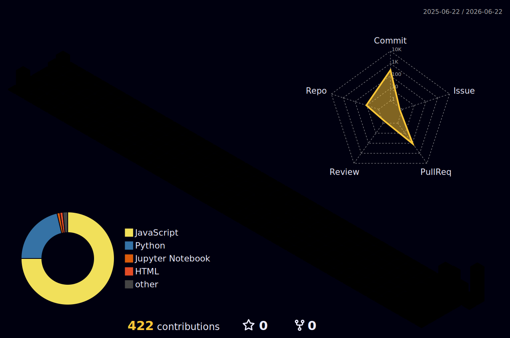

  

  

### 👋 こんにちは、cfn0eft です

Salesforce を中心に開発している、日本のエンジニアです ☕

  <a href="https://github.com/cfn0eft">
    <picture>
      <source media="(prefers-color-scheme: dark)" srcset="https://cdn.simpleicons.org/github/white">
      </picture></a>
  
  <a href="https://www.instagram.com/cfn0eft">
    <picture>
      <source media="(prefers-color-scheme: dark)" srcset="https://cdn.simpleicons.org/instagram/white">
      </picture></a>
  

## 🛠️ **技術スタック**

  
  
  

  
  
  
  

  
  
  

## 📊 **GitHub の統計**

  
  

  

  

## 📈 **詳細メトリクス**

<!-- 有効化手順:(1) 個人アクセストークンを作成 (2) リポジトリに METRICS_TOKEN として登録 (3) Actions で "Metrics" を1回実行 → github-metrics.svg 生成後、この行と末尾の閉じタグを削除すると表示されます

  

-->

## 🏆 **トロフィー**

  

## 🐍 **コントリビューション**

  <picture>
    <source media="(prefers-color-scheme: dark)" srcset="https://raw.githubusercontent.com/cfn0eft/cfn0eft/output/github-contribution-grid-snake-dark.svg" />
    <source media="(prefers-color-scheme: light)" srcset="https://raw.githubusercontent.com/cfn0eft/cfn0eft/output/github-contribution-grid-snake.svg" />
    
  </picture>

## 🏙️ **3D コントリビューション**

  <picture>
    <source media="(prefers-color-scheme: dark)" srcset="./profile-3d-contrib/profile-night-rainbow.svg" />
    <source media="(prefers-color-scheme: light)" srcset="./profile-3d-contrib/profile-season.svg" />
    
  </picture>

  

  **⭐ [cfn0eft](https://github.com/cfn0eft) より、❤️ を込めて**

